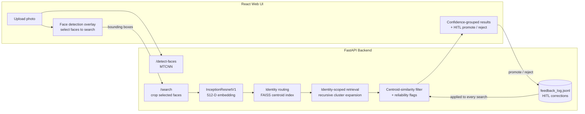

# 🔐 FaceVault — Identity-Scoped Face Retrieval System


FaceVault is an **end-to-end identity-aware face search pipeline** that converts raw
images into **searchable face instances**, builds **512-D embedding indexes**, and
performs **identity-scoped retrieval with reliability controls** to prevent
silent mis-identification.

The system is implemented as **modular phases**, fully benchmarked and
reproducible — now topped with a **production-ready API + Web UI**.

---

## 🎯 Core Intent — Simple & Honest

FaceVault is built for **high-trust institutional identity search**, such as:

• archival photo lookup  
• student / staff identity systems  
• controlled-access environments  
• verified database search  

Design principle:

> **Return the right person — and tell you clearly when confidence is low.**

So the pipeline integrates:

✔ FAISS vector search  
✔ identity-centroid routing  
✔ centroid-similarity filtering  
✔ ambiguity & gray-zone flagging  
✔ end-to-end evaluation & calibration  
✔ human-interpretable UI feedback  

This turns raw images into a **trustworthy identity-safe backend — not a similarity toy.**

---

## 🏗 Architecture



Routing decides **accepted / ambiguous / gray-zone / new-identity** before any
retrieval happens; results are then filtered against the identity centroid and
grouped by confidence — the UI never presents an uncertain match as certain.

---

## 📦 Project Phases

### ✅ **Phase-1 — Dataset Structuring & Face Extraction**

Raw images → **clean, queryable per-face dataset**

• Multi-face detection (MTCNN)  
• Each face assigned a unique `face_id`  
• Bounding boxes + metadata stored  
• Multiple people per image supported  
• CSV-backed audit trail  

📄 `README_PHASE1.md`

---

### ✅ **Phase-2 — 512-D Embedding Backbone**

Each detected face → **L2-normalized 512-D embedding**

• Backbone — **InceptionResnetV1 (VGGFace2 pretrained)**  
• Deterministic batch embedding  
• Resume-safe pipeline  

Outputs:
face_embeddings.npy
face_embedding_index.csv


📄 `README_PHASE2.md`

---

### ✅ **Phase-3 — Global Retrieval (FAISS)**

High-recall **cosine similarity search at scale**

• Global FAISS index  
• Centroid-guided expansion  
• Adaptive thresholds  
• Weak-match rejection  
• Precision-stability controls  

📄 `README_PHASE3.md`

---

### ✅ **Phase-4 — Identity-Scoped Routing & Risk Control**

Queries are first routed to the **most likely identity centroid**, and retrieval runs
**only inside that identity pool**, then **filtered by centroid-similarity confidence**, this magnificently improves the query run time.

Evaluated over **~10K live random queries:**

| Metric                  | Value |
|------------------------|------:|
| **Mean Precision**     | **0.946** |
| **Median Precision**   | **1.000** |
| **Mean Recall**        | **0.865** |
| **Avg Results / Query**| ~385 |

This phase introduces **production-grade identity-safety controls**:

✔ ambiguous-routing detection  
✔ gray-zone filtering  
✔ weak-cluster rejection  
✔ precision-risk flagging  

📄 `README_PHASE4.md`

---

### ✅ **Phase-5 — Reliability Tracking, Metrics & Evaluation UI**

We added automated **evaluation, routing-status statistics & quality dashboards**.

Example routing breakdown from ~10K query test:

| Status        | Count |
|---------------|------:|
| accepted      | 8646 |
| ambiguous     | 512 |
| gray-zone     | 320 |
| new-identity  | 0 |

Plus aggregated metrics:

• cosine similarity distributions  
• centroid-match certainty  
• failure analysis  
• recall/precision tracking  

This phase ensures FaceVault is **measurable, tunable & accountable.**

---

### 🟢 **Phase-6 — API + Web Application (Production Layer)**

FaceVault now ships with a **full-stack identity search platform:**

#### 🔌 **FastAPI Backend** (`Backend/main.py`)
• `POST /api/v1/detect-faces` — face region detection (MTCNN)  
• `POST /api/v1/search` — identity-scoped retrieval; accepts optional `boxes` (JSON list of bounding boxes) so the exact user-selected faces are searched  
• `GET /api/v1/photo/{face_id}` — serve a matched image (path-traversal-guarded)  
• `POST /api/v1/download-results` — bulk export ZIP  
• `POST /api/v1/feedback` — human-in-the-loop corrections, persisted to JSONL  
• `GET /api/v1/recent-searches`, `GET /api/v1/stats`, `GET /api/v1/health`  

Every response carries a real `X-Process-Time` header — the UI telemetry panel
shows **measured** server time, never estimates.

Uploads are **memory-only** — no persistent storage of query images.

---

#### 💻 **React Web UI — Identity-Safe Search Experience**

The UI makes reliability **explicit — never hidden.**

Features include:

✔ Upload an image (multi-face supported — select one)  
✔ Query routing progress UI  
✔ Confidence grouping:

✓ High-confidence matches
△ Borderline matches
⚠ Rejected / low-confidence (optional can be seen using developer view)


✔ Transparent similarity scoring (optional)  
✔ Precision-risk warnings  
✔ Search history table  
✔ Bulk-download of matches  

This turns FaceVault into a **human-centered identity tool** — not a black box.

---

## 🛡 Reliability Philosophy

Unlike raw cosine-search engines:

> **FaceVault enforces high-precision while still maintaining strong recall.**

When confidence is uncertain, the UI explicitly flags:

• **Ambiguous**
• **Low-confidence**
• **No-match / new identity candidate**

so **operators always know what to trust.**

---

## ⭐ Project Status

FaceVault now implements a **full identity-aware retrieval system**:

✔ dataset structuring  
✔ embedding generation  
✔ FAISS retrieval  
✔ identity routing  
✔ reliability controls  
✔ evaluation engine  
✔ Web UI + API backend  

### 🔜 Open Work — New-Identity Registration

We now support safe detection of potential **new identities**, but:

> **Automatic identity-creation remains disabled by design.**

The planned workflow:

• detect genuine new identity clusters  
• trigger human approval  
• register identity + update index incrementally  

Also planned:

• threshold auto-calibration driven by the human-feedback log  
• Dockerfile + docker-compose for one-command deployment  

This is **open for iteration / contribution.**

---

## ⚠ Responsible Use

FaceVault is intended for **consented environments only**, such as:

• archival search  
• campus photo systems  
• controlled-access identity lookup  

It is **not designed for surveillance.**

---

## 🚀 Run Locally

**Backend** (expects data assets under `Backend/data/`, see `Dataset_links.txt`):

```bash
cd Backend
pip install -r ../requirements.txt
uvicorn main:app --reload          # http://127.0.0.1:8000
```

**Frontend:**

```bash
cd Frontend
npm install
npm run dev                        # http://localhost:5173
```

Point the UI at a non-default backend with `VITE_API_ROOT`.

All backend tunables are `FACEVAULT_*` environment variables (see `Backend/config.py`):
CORS origins, optional API key (`FACEVAULT_API_KEY` → clients must send `X-API-Key`),
rate limits, upload caps, retrieval parameters, and model-weights pinning.
On first run the model weights are vendored to `Backend/models/` and their SHA-256 is
logged — pin it with `FACEVAULT_WEIGHTS_SHA256` for offline, tamper-evident startups.
Runtime state (search log, human feedback) lives in SQLite at `Backend/data/facevault.db`.

**Tests** (also run in CI on every push):

```bash
cd Backend && pip install pytest && pytest tests -q   # 23 logic tests, no GPU/data needed
cd Frontend && npm test                               # 8 vitest tests
```

---

## 📄 Phase Documentation Index

• `README_PHASE1.md`  
• `README_PHASE2.md`  
• `README_PHASE3.md`  
• `README_PHASE4.md`  

Interactive API docs (Swagger) are served by FastAPI at `/docs` when the backend is running.

---

FaceVault’s core value is simple:

> **Trust the results — and when you shouldn’t, we tell you.**

Caution : 

VGGFace2 images are NOT included in this repo.
Users must obtain the dataset from the official source
and place it under ./data/VGGFace2

This project does NOT distribute biometric data.
Only derived embeddings + metadata are published.


